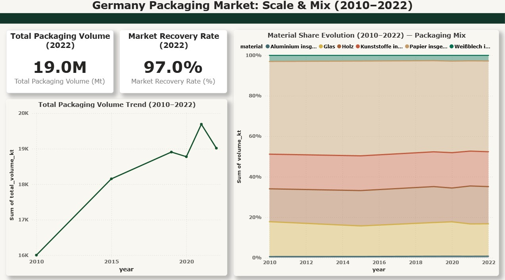
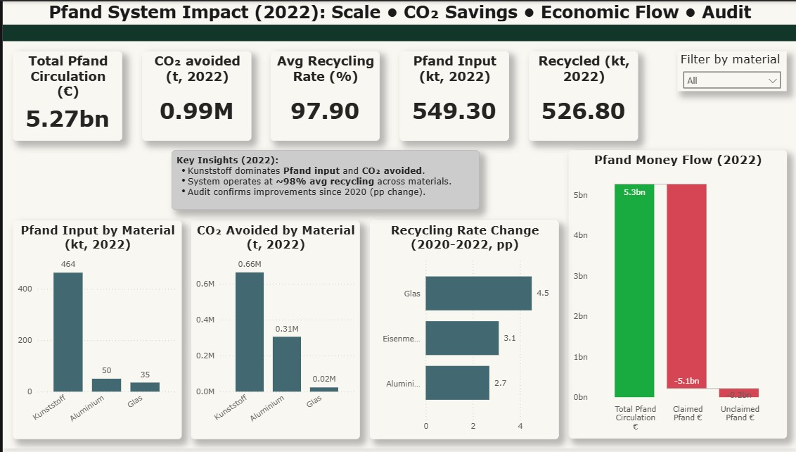

# Pfand System Analysis (Germany) — Deposit Return Scheme (ESG Data Analytics)

A portfolio-ready data analytics case study on Germany’s **Pfand (deposit-return)** system, built with a **consulting-style narrative**:

**Macro Problem (2010–2022 packaging market) → Micro Solution (Pfand 2022 baseline) → Verified Audit (2020 vs 2022 statutory checkpoint)**

This project combines official German sources with a reproducible Python workflow and an interactive Power BI report.

---

## Dashboard Preview (Power BI)

### Page 1 — Macro Packaging Context (2010–2022)
Shows the **overall scale** of packaging volumes and how the **material mix evolved** over time.



### Page 2 — Pfand System Impact (2022 Baseline)
Shows the **Pfand system baseline** for 2022:
- system scale (input + recycled volumes),
- environmental impact (CO₂ avoided by material),
- economic mechanism (deposit money flow),
- statutory validation (2020 → 2022 audit delta in pp).




## Key Results (2022 Baseline)
From the finalized dashboard exports:
- **Pfand input:** 549.3 kt  
- **Recycled:** 526.8 kt  
- **Avg recycling rate:** 97.9%  
- **CO₂ avoided:** ~0.99 Mt  
- **Deposit circulation:** ~€5.27 bn  
- **Statutory checkpoint (2020 → 2022):** material-level recycling-rate change (pp) from official §31 tables

---

## What This Project Answers
- How large is Germany’s packaging market and how has it changed (2010–2022)?
- What is the **Pfand system baseline** in 2022 (volumes + recycling performance)?
- Which materials drive the **biggest CO₂ savings** under Pfand?
- How does the **€0.25 deposit** operate economically (claimed vs unclaimed value)?
- Do statutory tables confirm measurable performance change (2020 vs 2022)?

---

## Data Sources (Primary)
Official German reporting (Umweltbundesamt / UBA), including statutory packaging tables:
- **UBA 156/2024** — §31 VerpackG tables (Year 2022)
- **UBA 109/2022** — §31 VerpackG tables (Year 2020)

> The “2020 vs 2022 checkpoint” is intentionally **Pfand-only (§31)** to avoid mixing Pfand and non-Pfand trends.

---

## Method Summary
### 1) Data preparation (Python)
- Cleaned and standardized official tables (units, materials, year labels)
- Produced **dashboard-ready exports** with consistent naming

### 2) ESG impact modeling (2022 baseline)
- Material-level recycled volumes (kt)
- CO₂ avoided by material using factor constants
- Deposit circulation and unclaimed Pfand estimation (economic flow)

### 3) Statutory audit checkpoint (2020 vs 2022)
- Built a defensible 2-year checkpoint (not a 2010–2022 Pfand trendline)
- Output: recycling-rate change in percentage points (pp) by material

---

## Tech Stack
- **Python**: pandas, numpy (data prep + modeling)
- **Jupyter Notebooks**: reproducible workflow + documentation
- **Power BI**: data model, measures, interactive report pages
- **Git/GitHub**: version control and portfolio packaging

---

## Repository Structure
```text
data/
  cleaned/                          # final dashboard-ready exports (CSV)
  raw/                              # optional raw files (may be excluded from git)
dashboard/
  dashboard2.pbix                   # Power BI report
notebooks/
  *.ipynb                           # data prep + modeling notebooks
assets/
  dashboard/                        # screenshots for README
  notebooks/                        # optional notebook visuals
